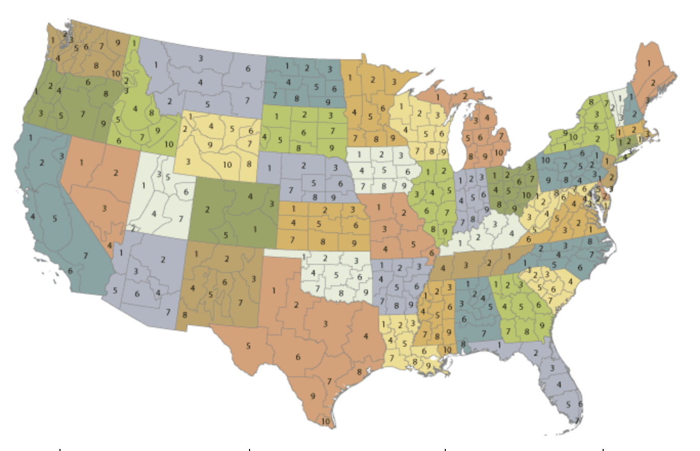

# Capstone Project
# Modeling Droughts in the Contiguous United States
### David Bertsch
### May 17, 2019

### *Notebook Directory*

- *[1a - National Data Loading](./1a-Data_Loading_National.ipynb)*
- *[1b - Climate Division Data Loading](./1b-Data_Loading_Climate_Div.ipynb)*
- *[2 - Climate Division Data Mapping](./2-Data_Mapping_Climate_Div.ipynb)*
- *[3 - Data Compiling](./3-Data_Compiling.ipynb)*
- *[4 - Data Simplification](./4-Simplifying_Data_to_3D.ipynb)*
- *[5 - National Drought Analysis](./5-National_Drought_Data_Analysis.ipynb)*
- *[6a - CNN Model 1](./6a-CNN_initial.ipynb)*
- *[6b - CNN Model 2](./6b-CNN_3D_initial_model_with_25_epochs.ipynb)*
- *[6c - CNN Model 3](./6c-CNN_second_model_50_epochs.ipynb)*
- *[6d - CNN Model 4](./6d-CNN_third_model_35_epochs.ipynb)*
- *[6e - CNN Model 5](./6e-CNN_fourth_model_8_lags_25_epochs.ipynb)*

## Problem
1. What are the climatic trends of droughts in the United States?
2. How can droughts in local regions across the United States be modeled in order to make predictions of future conditions?

## Data
I gathered data from the [United States Drought Monitor](https://droughtmonitor.unl.edu/Data/DataDownload/ComprehensiveStatistics.aspx). Geographically, one dataset is a time series of aggregate drought levels for the entire contiguous United States (CONUS), and the other dataset is broken down into climate subdivisions. Background information of these climate divisions can be found from the [National Oceanic and Atmospheric Administrations (NOAA):](https://www.ncdc.noaa.gov/monitoring-references/maps/us-climate-divisions.php)

Here is a map of these divisions:

## Plan
*1. What are the climatic trends of droughts in the United States?*

- Visually analyze the national time series data to qualitatively assess trends in the data over time. 
- Build a SARIMA model to forecast future national drought conditions.

*2. How can droughts in local regions across the United States be modeled in order to make predictions of future conditions?*

- Map local drought data to rectangular grid of "pixels"
- Construct Convolutional Neural Network (CNN) model in order to discern spatiotemporal patterns
- Feed predictions into model in order to generate long term forecast

## Hypotheses

- Droughts in the US are trending towards more severe.
- Areas that are the most prone to droughts are undergoing the most pronounced increases in drought levels.

## Modeling

In order to analyze and forecast the national drought data, I will build SARIMA models for each of the 6 different drought measurements and their composite "drought score" (that I generate as a weighted sum of the 6 different drought measurements). 

In order to model the localized drought conditions across the CONUS, I will build a convolutional neural network that predicts the drought levels across the map of the contiguous United States. Initially, I will set the data up by defining a rectangular grid of equally spaced latitudes and longitudes. Then, I will assign each latitude and longitude a time series of the composite drought score data based on which of the climate divisions the point falls into. Then, I will set up the model so that the Y variable is the drought score at a single point in time for each latitude and longitude. The X variable is a subset of the previous points in time. I will test models with a few different constructions of X.

## Results and Plans for Improvement

In analyzing the national drought conditions over time, there were a couple of things that stood out. For most of the drought indicators, the changes over time were subtle. In general the mean levels for these drought metrics does not seem to be trending up or down. Most of the difference is in the nature of the fluctuations. In the more recent dates in the time series, there are larger sudden fluctuations compared to the beginning. Also, for the indicators of extreme and exceptional drought, there are longer wavelengths in the seasonal fluctuations, representing periods of drought that are more sustained. In terms of the model performance, I am able to capture some of the seasonality and long term trends in the time series for most of the drought measurements. My models are not very good at predicting short term fluctuations. With further tuning, I think I can generate meaningful long term forecasts. As my models currently stand, they may have some use in forecasting long range trends, but I think they are not yet reliable.

For the CNN model, I was able to generate predictions that resembled drought fluctuations that occur in the actual data, but the model's predicted fluctuations are not lined up with the actual data. The model also is limited in that it tends to only predict drought in the southern localities, and so it does not seem to capture drought conditions that occur in the northern midwest for instance. I am not sure that this is a viable approach for making predictions, but I will work on improving this as much as I can. The most important improvements will be to find a way to implement an R2 score metric for keras that computes the R2 score for each point in space and aggregates it. As it is with just the MSE and MAE, I am not able to meaningfully quantify the performance of the models. The MSE and MAE at least can be used to find the optimum number of epochs to run in the CNN models, and I would like to try running even more epochs moving forward, since the MSE and MAE were still improving even in the model with 50 epochs. One limitation with this kind of modeling is that there is very long computation time. Furthermore, the limitations of my machine are such that I can only consider so many lags as my X variable without crashing the kernel. If I am able to substantially improve the model performance moving forward, I will look into using cloud computing in order to make the modeling more efficient.

If I am able to attain good performance with this type of model, I will then focus on working it into a recurrent neural network, so that the predictions from the CNN are fed into the X variable for future dates. With the model as it is currently constructed, even if the performance is excellent, it is not practically useful for making climatic predictions, since it relies on recent data for each prediction.

One other idea for building on this is to run non-spatially-dependent time series models for each point on the grid. Then, I could compile all of the models' predictions together to form the same output that my current model has. It would be an interesting point of comparison.

## Conclusions

*1. What are the climatic trends of droughts in the United States?*

- There have been longer, more frequent, more sudden, and more severe periods of drought in the contiguous United States from 2011-2019 compared to 2000-2010, which suggests a general trend moving forward. 
- It would be interesting to compare this time series against historical data from before 2000 in order to get a better sense of how the trends in this data compare against a longer span of history.

*2. How can droughts in local regions across the United States be modeled in order to make predictions of future conditions?*

- A CNN model is potentially useful as a tool to build a spatio-temporal model. While I have not been able to fully put it together for the purposes of generating long-range drought predictions, I think that I can potentially achieve this with continued work.
- If a CNN model is built that accurately predicts the map of drought conditions based on previous points in time, that would still need to be expanded into a recurrent model that used the CNN model's predictions as a new X for long range forecasting.
